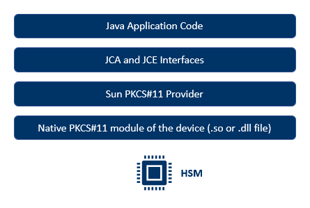
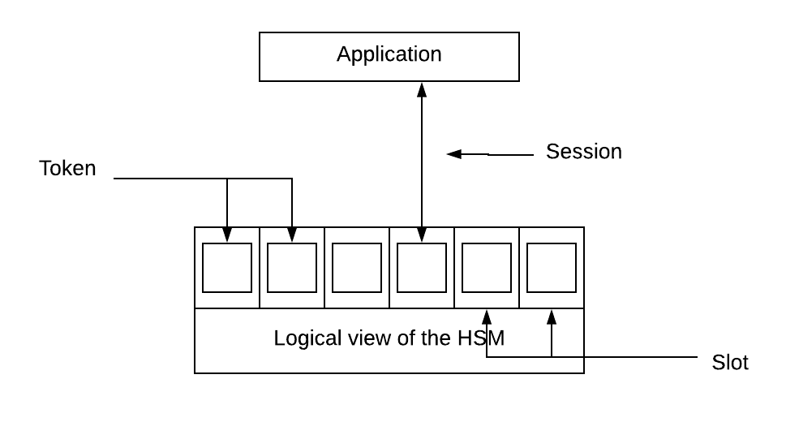

* references
  * https://stackoverflow.com/questions/43114733/java-complains-on-loading-pkcs-dll-from-softhsm
  * https://clydedcruz.medium.com/a-dive-into-softhsm-e4be3e70c7bc
  * https://www.ibm.com/docs/en/linux-on-systems?topic=introduction-what-is-pkcs-11
  * https://www.securew2.com/blog/what-is-pkcs11
  * https://blog.devgenius.io/what-is-hardware-security-module-a-brief-explanation-6ac448f2cfa9
  * https://clydedcruz.medium.com/a-dive-into-softhsm-e4be3e70c7bc
  * https://medium.com/@gerritjvv/java-cryptography-api-and-keystorage-88bd350ec1b7
  * https://medium.com/@mevan.karu/standard-api-for-connecting-hsms-with-client-applications-6296eb187d89
  * http://docs.oasis-open.org/pkcs11/pkcs11-base/v2.40/os/pkcs11-base-v2.40-os.html
  * https://docs.oracle.com/en/java/javase/12/security/pkcs11-reference-guide1.html#GUID-6DA72F34-6C6A-4F7D-ADBA-5811576A9331
  * https://thalesdocs.com/gphsm/ptk/5.9/docs/Content/PTK-C_Program/intro_PKCS11.htm
  * https://medium.com/@mevan.karu/want-to-know-how-to-talk-to-a-hsm-at-code-level-69cb9ba7b392
  * https://medium.com/@mevan.karu/secure-cryptographic-operations-with-hardware-security-modules-d54734834d7e
## pkcs11
* PKCS = The Public-Key Cryptography Standards
* cryptographic token interface standard
* specifies an API, called Cryptographic APIs (Cryptoki)
    * applications can address cryptographic devices as tokens
      * example: such as smart cards, USB keys, and Hardware Security Modules (HSMs)
    * and can perform cryptographic functions as implemented by these tokens
      * example: create or delete cryptographic data like public-private key pairs
    * API defines the most commonly used cryptographic object types (RSA keys, X.509 Certificates, DES/Triple DES keys, etc.)
      * and all the functions needed to use, create/generate, modify, and delete those objects.
* PKCS#11 specifies an Application Programming Interface(API) called Cryptoki for devices that hold cryptographic information and perform cryptographic functions.
  * These devices are known as Cryptographic Tokens.
* The PKCS#11 configuration file must contain the location of the .so file and the slot number of the token.
  * Attributes in the PKCS#11 Provider Configuration File
  * library, Pathname of PKCS#11 implementation,
  * name. Name suffix of this provider instance, This string is concatenated with the prefix SunPKCS11- to produce this provider instance's name (that is, the string returned by its Provider.getName() method). For example, if the name attribute is "FooAccelerator", then the provider instance's name will be "SunPKCS11-FooAccelerator".
  * description. Description of this provider instance. This string will be returned by the provider instance's Provider.getInfo() method
  * slot. Slot id, This is the id of the slot that this provider instance is to be associated with. For example, you would use 1 for the slot with the id 1 under PKCS#11
  * slotListIndex, Slot index, This is the slot index that this provider instance is to be associated with. It is the index into the list of all slots returned by the PKCS#11 function C_GetSlotList. For example, 0 indicates the first slot in the list. At most one of slot or slotListIndex may be specified. If neither is specified, the default is a slotListIndex of 0.
  * enabledMechanisms, Brace enclosed, whitespace-separated list of PKCS#11 mechanisms to enable,
    * enabledMechanisms = {
      CKM_RSA_PKCS
      CKM_RSA_PKCS_KEY_PAIR_GEN
      }
    * If neither is specified, the mechanisms enabled are those that are supported by both the SunPKCS11 provider (see SunPKCS11 Provider Supported Algorithms) and the PKCS#11 token.
  * attributes, The attributes option can be used to specify additional PKCS#11 that should be set when creating PKCS#11 key objects
    * The attributes option allows you to specify additional PKCS#11 attributes that should be set when creating PKCS#11 key objects
    * By default, the SunPKCS11 provider only specifies mandatory PKCS#11 attributes when creating objects
      * For example, for RSA public keys it specifies the key type and algorithm (CKA_CLASS and CKA_KEY_TYPE) and the key values for RSA public keys (CKA_MODULUS and CKA_PUBLIC_EXPONENT)
    * The option can be specified zero or more times, the options are processed in the order specified in the configuration file as described below. The attributes option has the format:
      * attributes(operation, keytype, keyalgorithm) = {
        name1 = value1
        [...]
        }
      * Valid values for operation are:

                 generate, for keys generated via a KeyPairGenerator or KeyGenerator
                 import, for keys created via a KeyFactory or SecretKeyFactory. This also applies to Java software keys automatically converted to PKCS#11 key objects when they are passed to the initialization method of a cryptographic operation, for example Signature.initSign().
                 *, for keys created using either a generate or a create operation.
      * Valid values for keytype are CKO_PUBLIC_KEY, CKO_PRIVATE_KEY, and CKO_SECRET_KEY, for public, private, and secret keys, respectively, and * to match any type of key.
      * Valid values for keyalgorithm are one of the CKK_xxx constants from the PKCS#11 specification, or * to match keys of any algorithm. The algorithms currently supported by the SunPKCS11 provider include CKK_RSA, CKK_DSA, CKK_DH, CKK_AES, CKK_DES, CKK_DES3, CKK_RC4, CKK_BLOWFISH, CKK_GENERIC_SECRET, and CKK_EC.
      * The attribute names and values are specified as a list of one or more name-value pairs. name must be a CKA_xxx constant from the PKCS#11 specification, for example CKA_SENSITIVE. value can be one of the following:

        A boolean value, true or false
        An integer, in decimal form (default) or in hexadecimal form if it begins with 0x.
        null, indicating that this attribute should not be specified when creating objects.
  * There is also a special form of the attributes option. You can write attributes = compatibility in the configuration file. That is a shortcut for a whole set of attribute statements.
    * They are designed to provider maximum compatibility with existing Java applications, which may expect, for example, all key components to be accessible and secret keys to be usable for both encryption and decryption.
* The PKCS11 standard comes with a series of C header files (pkcs11.h, pkcs11f.h and pkcs11t.h), which different hardware providers provide implementations for.
* The lingua franca for hardware is C, so Java has to provide a JCA wrapper for it via JNI, this is essentially what sun.security.pkcs11.SunPKCS11 is, just a huge wrapper class that via JNI calls into the native module (.so, .dll) that implements the PKCS11 C header files.
* PKCS #11 is a standard API specified by OASIS Open which is a global nonprofit organization that works on the development, convergence, and adoption of open standards for security, IoT, energy, content technologies, emergency management, and other areas
* “The PKCS#11 standard specifies an application programming interface (API), called “Cryptoki,” for devices that hold cryptographic information and perform cryptographic functions.” — OASIS Documentation
* PKCS #11 is not an implementation of a API, it is a specification of the required set of rules and guidelines for the implementation of the API
* OASIS Open provides only a set of ANSI C header files defining the interface exposed to client application
* HSM vendor is responsible for providing concrete implementation of the functionalities specified in PKCS #11.
* Application directly speaks to the PKCS #11 API and API is responsible for calling the PKCS #11 module through C calls.
  * Then the module speaks to the HSM via native calls
  * Module hand over the response from HSM to application through C interface implementation.
* glossary
  * Token
    Token is the logical view of the underlying cryptographic device. A token possesses a list of cryptographic functionalities supported by the device.
  * Slot
    This is a logical access point to the cryptographic device. Objects that resides within a given slot is not visible to other slots.
    * there are several slots for a given token. What application sees is there’s a token inside each slot. But if there is only one HSM then the token is same for all the slots. In here application gets the view of multiple independent tokens so this HSM can be used by other applications from different slots concurrently.
  * Session
    Session is a logical connection between an application and a token. There are two types of sessions defined in PKCS #11 as Read/Write(R/W) and Read-Only(R/O). R/W sessions can be used for both reading and writing data to the cryptographic device while R/O can only be used for data reading purposes from the device.
  * User
    User is a person or an application who has access to the cryptographic device through a slot. There are basically two users defined in PKCS #11 as SO(Security Officer) and USER for each slot. SO has the authority to create a USER. USER is responsible for using device for cryptographic operations. There can be only one SO and USER for a given slot.
  *  The term slot represents a physical device interface
    * For example, a smart card reader would represent a slot and the smart card would represent the token.
  *   * It is also possible that multiple slots may share the same token.
  * Within PKCS#11, a token is viewed as a device that stores objects and can perform cryptographic functions.
  * Objects are generally defined in one of four classes:

    >Data objects, which are defined by an application

    >Certificate objects, which are digital certificates such as X.509

    >Key objects, which can be public, private or secret cryptographic keys

    >Vendor-defined objects
  * Objects within PKCS#11 are further defined as either a token object or a session object
    * Token objects are visible by any application which has sufficient access permission and is connected to that token. An important attribute of a token object is that it remains on the token until a specific action is performed to remove it.
    * A connection between a token and an application is referred to as a session. Session objects are temporary and only remain in existence while the session is open. Session objects are only ever visible to the application that created them.

* example
  * Crypto is an application which is using PKCS #11 supported HSM as it’s cryptographic provider. Crypto needs to generate an AES key using HSM and encrypt a sample of data using the generated key.
    * Crypto authenticates itself as user ‘USER’ to the HSM and creates a secure communication passage(ie. session between token and application) between device(ie. token resides within a slot) and Crypto.
      Crypto asks HSM to generate an AES key through the created communication passage(ie. session).
      HSM returns the created AES key through the passage.
      Crypto sends set of data needs to be encrypted with the encryption key through the safe passage.
      HSM sends back the ciphered data to the application through the communication passage.
      Crypto close the communication passage.
* There could be issues with PKCS#11 which requires debugging.
  * To show debug info about Library, Slots, Token, and Mechanism, add showInfo=true in the SunPKCS11 provider configuration file, which is <java-home>/conf/security/sunpkcs11-solaris.cfg or the configuration file that you specified statically or dynamically as described in SunPKCS11 Configuration.
  * For additional debugging info, users can start or restart the Java processes with one of the following options:

    For general SunPKCS11 provider debugging info:

    -Djava.security.debug=sunpkcs11

    For PKCS#11 keystore specific debugging info:

    -Djava.security.debug=pkcs11keystore
* Certain PKCS#11 operations, such as accessing private keys, require a login using a Personal Identification Number, or PIN, before the operations can proceed
* When accessing the PKCS#11 token as a keystore via the java.security.KeyStore class, you can supply the PIN in the password input parameter to the load method
  * char[] pin = ...;
    KeyStore ks = KeyStore.getInstance("PKCS11");
    ks.load(null, pin);
* An unextractable key on a secure token (such as a smartcard) is represented by a Java Key object that does not contain the actual key material. The Key object only contains a reference to the actual key.
  Software Key objects (or any Key object that has access to the actual key material) should implement the interfaces in the java.security.interfaces and javax.crypto.interfaces packages (such as DSAPrivateKey).

## hsm
* a physical device that protect and manage digital keys and provides crypto-processing function
  * example: generating the key, store the key, using the key for decrypt/encrypt operation, and discarding the key
* attaches directly to a server and is used to securely manage and perform operations on cryptographic keys
* secret key will never leave HSM in unencrypted format
* many different forms
    * PCIe, where the HSM came in PCIe form to be embedded in server
      * Example: Thales Luna PCIe HSM
    * standalone appliance, where the HSM came in the form of standalone appliance
      * Example: Utimaco Cryptoserver CP5
    * USB, where the HSM came in the form of USB stick
      * Example: YubiHSM 2
* use cases
  * generation, storage and operation of private key of Certificate Authority (CA)
  * generation, storage and operation of private key for https operation of an web server
  * digitally sign a PDF file
* to interact with the HSM, we need some kind of protocol
    * common protocol: PKCS#1
    * HSM Vendors will expose its function through this Cryptoki
    * usually, HSM Vendors also have their own proprietary protocol and SDK for developer to use
* The purpose of these devices is, among others, to generate cryptographic keys and sign information without revealing private-key material to the outside world
* HSMs are commonly used in Public Key Cryptography (PKI) deployments to secure Certificate Authority keys
* layers involved in interacting with an HSM
  
  * Java Cryptography Architecture (JCA) and Java Cryptography Extension (JCE)
    * Java defines a set of programming interfaces for performing cryptographic operations
    * These interfaces are provider-based
      * This means that when performing a cryptographic operation in our application, the application talks to the interface, but the actual operation is performed in the configured provider which implements that interface
    * The Java Cryptography Api or JCA is a plugable architecture which tries to abstract the actual crypto implementation from the algorithm requested.
    * This allows our code to use Cipher.getInstance(“AES”), and not have to hard code the actual implementation, better or different implementations can be swapped out depending on deployment requirements.
    * At the heart of the JCA architecture is the Provider abstract class, a specific provider will register different algorithm implementations where each implementation implements a specific *SPI (service provider interface) abstract class depending on which algorithm it’s implementing.
  * Sun PKCS#11 provider does not implement cryptographic algorithms by itself, but acts as a bridge between the JCA, JCE APIs and the native PKCS#11 module
    * native module must be in the form of a shared-object library (.so file on Solaris and Linux) or dynamic-link library (.dll on Windows) and is provided by the vendor of the HSM device
      * Instead, it acts as a bridge between the Java JCA and JCE APIs and the native PKCS#11 cryptographic API, translating the calls and conventions between the two.
      * cryptographic devices such as Smartcards and hardware accelerators often come with software that includes a PKCS#11 implementation, which you need to install and configure according to manufacturer's instructions
    * The SunPKCS11 provider, in contrast to most other providers, does not implement cryptographic algorithms itself
    * for example
      * sun.security.pkcs12.PKCS12KeyStore extends java.security.KeyStoreSPI which is the JCA abstraction for a KeyStore
* As you can see for any application to use the HSM it should first initiate a session with a token.
  * All cryptographic operations provided in the HSM are used via an initiated session.
* Application doesn’t have to bear the burden of handling multiple HSMs because it is handled by the PKCS #11 API. PKCS #11 API is designed integrating load balancing techniques so that cryptographic operations are fairly distributed over set of HSMs connected to the application.
  
* Multiple applications using multiple HSMs through PKCS #11 API
* HSM vendors provide the PKCS #11 implementation in C language. Hope you already know it, then here is an obvious question…
* How to develop a Java application using C module?
  * So we need a wrapper to map C data structures to Java data structures and vice versa.
  * Some of famous wrappers are SunPKCS11, IBM PKCS11 and IAIK PKCS11 wrapper
    * SunPKCS11 doesn’t provide an object oriented mapping of data structures and IBM wrapper isn’t an open source project
    * http://javadoc.iaik.tugraz.at/pkcs11_wrapper/current/index.html

* A HSM is a trusted, hardened, tamper resistant, dedicated crypto processor designed to perform strengthened cryptographic operations such as encrypting, decrypting, digital signing, digital sign verifying, hashing etc.
* HSM has a specially designed, well-tested hardware to perform cryptographic operations faster than a normal computer and security-focused OS to secure sensitive data from intruders
* Normally these modules can be attached to a computer or a network sever externally via a USB port
* HSM plays a major role in the aspect of system’s security and it can become a single point of failure to the system
  * Because of that most of the HSM vendors provide capability of using HSM clusters for high availability and load balancing.
* There are several benefits of using HSMs over software cryptographic providers
  * Secured key management process
    * HSMs are good at providing both logical and physical protection.
    * HSMs keep sensitive materials such as private keys, symmetric keys within the HSM throughout their life cycle without exposing them to outside
    * Since all key operations are taking place inside the HSM so that only authorized users can use the keys
    * Also HSMs provide additional security by being tamper resistant which means device become inoperable in case of a tampering
    * A HSM maintains a log containing all information on operations carried out using keys which makes it easier to determine if any intrusions or misuse of keys have been taken place.
  * Increase the throughput of the system
    * Software cryptographic providers utilize server resources for cryptographic operations causing performance degradation in the server
    * As I mentioned earlier HSMs are designed and optimized to carry out cryptographic operations more efficiently and securely
    * Integrating a HSM to a system causes increase in the overall performance of the system since, server resources can be utilized for business logic processing and also HSMs are much faster at crypto processing than a normal CPU.
  * Strong key generation
    *  computer is a finite state machine, since it is not capable of generating truly random values
    * But when it comes to HSMs, it uses a special physical processes to generate truly random keys which makes generated keys strong
    * So keys generated using software are inherently weaker than those generated using HSMs.
  * Can meet current standards and regulations on cyber security
    * FIPS 140-2 is an internationally recognized standard for hardware cryptographic devices which defines the level of security provided by them
    * There are four security levels defined in FIPS 140–2 and almost every HSM in the market is standardized under those levels
    * So integrating HSMs to a system makes it easier to get compliance with current security regulations.

## softhsm
* SoftHSM isn’t exactly an HSM per se, but a software implementation of a generic PKCS#11 device
* cmds
  *  softhsm2-util --show-slots

## attacks
* [Explaining HSMs | Part 3 - Common Attacks](https://www.youtube.com/watch?v=aRjuUPYE-tk)
* [Explaining HSMs | Part 4 - HSM Fuzzing](https://www.youtube.com/watch?v=bw0V7dl_zdA)